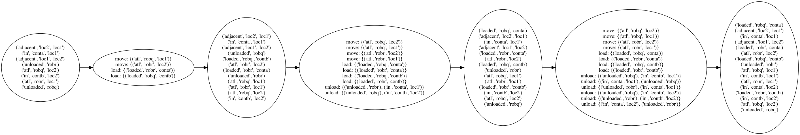

# planning-graph

This library implements Planning Graph and its planner that can be used to solve STRIPS-like AI Planning Problems using PDDL. Planning graphs and associated planner was first introduced in:

* A. Blum and M. Furst (1997). [Fast planning through planning graph analysis](https://www.sciencedirect.com/science/article/pii/S0004370296000471). Artificial intelligence. 90:281-300.

Given a domain and problem in PDDL, the library can comptue the planning graph, output it to an image, as well as compute a solution plan from it if any exists.

An associated post to this repo can be found at [here](https://towardsdatascience.com/improving-classical-ai-planning-complexity-with-planning-graph-c63d47f87018).

## Installation

Alternatively, it can be installed directly from the repo:

```console
pip install git+https://github.com/COSC1127-AI/planning_graph
```

or, clone the repository and install:

```shell
$ git clone https://github.com/COSC1127-AI/planning_graph
$ cd fond-utils
$ pip install .
```

For development, it is best to install the package as editable: `pip install -e .`

> [!CAUTION]
> The original repo publishes in PyPi [here](https://pypi.org/project/planning-graph/), but it is currently different from the version provided in this repo.

## Usage

The `pyplangraph` package can be used both as a command-line tool and as a Python library.

### Command Line Interface

After installation, you can use the `pyplangraph` command to generate planning graphs, its visualization, and plans:

```console
pyplangraph domain/dock-worker-robot-domain.pddl domain/dock-worker-robot-problem.pddl --output my_graph.png --max 10 --plan
Planning graph created with Planning Graph object with 4 levels levels.
Layered plan: LayeredPlan. Levels=4
0 []
1 ['load(loc2, contb, robq)', 'load(loc1, conta, robr)']
2 ['move(robq, loc2, loc1)', 'move(robr, loc1, loc2)']
3 ['unload(loc1, contb, robq)', 'unload(loc2, conta, robr)']
```

### As a Python Library

To create a Planning Graph from PDDL files:

```python
from pyplangraph.planning_graph.planning_graph import PlanningGraph

planning_graph = PlanningGraph('domain/dock-worker-robot-domain.pddl',
                               'domain/dock-worker-robot-problem.pddl')

graph = planning_graph.create(max_num_of_levels=10)
```

The `planning_graph.create()` method returns a Graph object if the goal state is achieved, or the maximum number of levels have been reached.

To create an image visualization of the planning graph, you can set `visualize=True` (by default it is set to `False`) and then visualize it as a PNG image:

```python
from pyplangraph.planning_graph.planning_graph import PlanningGraph

planning_graph = PlanningGraph('domain/dock-worker-robot-domain.pddl',
                               'domain/dock-worker-robot-problem.pddl',
                               visualize=True)

graph = planning_graph.create(max_num_of_levels=10)
graph.visualize_png("generated_graph.png")
```

The result looks like the following:



#### Finding a Solution Plan

To find a solution plan you simply have to create a Planner and pass the arguments it requires:

```python
from pyplangraph.planning_graph.planning_graph import PlanningGraph
from pyplangraph.planning_graph.planning_graph_planner import GraphPlanner

planning_graph = PlanningGraph('domain/dock-worker-robot-domain.pddl',
                               'domain/dock-worker-robot-problem.pddl')

graph = planning_graph.create(max_num_of_levels=10)
goal = planning_graph.goal
graph_planner = GraphPlanner()
layered_plan = graph_planner.plan(graph, goal, planning_graph)
```

This returns a layered plan if the solution exists, otherwise, it returns `None`.

#### Complete Example

Here's a complete example that creates a planning graph, visualizes it, and extracts a plan:

```python
from pyplangraph.planning_graph.planning_graph import PlanningGraph, NoOpAction
from pyplangraph.planning_graph.planning_graph_planner import GraphPlanner

# Create planning graph with visualization enabled
planning_graph = PlanningGraph('domain/dock-worker-robot-domain.pddl',
                               'domain/dock-worker-robot-problem.pddl',
                               visualize=True)

# Generate the graph
graph = planning_graph.create(max_num_of_levels=10)
print(f"Planning graph created with {graph} levels.")

# Save visualization
graph.visualize_png("my_planning_graph.png")

# Extract a plan
goal = planning_graph.goal
graph_planner = GraphPlanner()
layered_plan = graph_planner.plan(graph, goal, planning_graph)

if layered_plan is None:
    print("No plan can be generated.")
else:
    print(f"Layered plan: {layered_plan}")
    for k in layered_plan.data:
        plan = [str(x) for x in layered_plan.data[k].plan if not isinstance(x, NoOpAction)]
        print(f"Level {k}: {plan}")
```

**NOTE:** the above assumes the system has been installed as a package.

## pddlpy

`pddlpy` included in this repo is the work of Hernán M. Foffani, it is copied from [here.](https://github.com/hfoffani/pddl-lib). It is copied because it won't work when installed as a package due to wrong version of antlr4 package. There are no changes made to it.

> [!NOTE]
> Would be best to migrate the parser to [pddl](https://github.com/AI-Planning/pddl) - see issue [#3](https://github.com/COSC1127-AI/planning_graph/issues/3)
